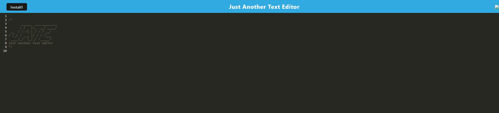

# J.A.T.E.

## Description

Just another text editor.

## Table of Contents

- [Installation](#installation)
- [Usage](#usage)
- [Credits](#credits)
- [License](#license)
- [Features](#features)
- [Contributions](#contributions)
- [Tests](#tests)
- [Questions](#questions)
- [Screenshot](#screenshot)

## Installation

N/A

## Usage

I's literally just another text editor; add your text and the app will store indefinitely until you erase and start again.

## Credits

My instructor Leif for all he has taught me.

## License

This project uses the [MIT](https://choosealicense.com/licenses/mit/) License.

---

## Features

The biggest features of this application are webpack, some plugins and addons for it, and babel js.

## Contributions

N/A 

Also see [Contributor Covenant](https://www.contributor-covenant.org/).

## Tests

N/A

## Questions

If you have any questions or concerns reach out to me via one of the following: 

GitHub: [xWhoKnowz](https://github.com/xWhoKnowz) 
Email: TBD

## Webpage Screenshot
    
